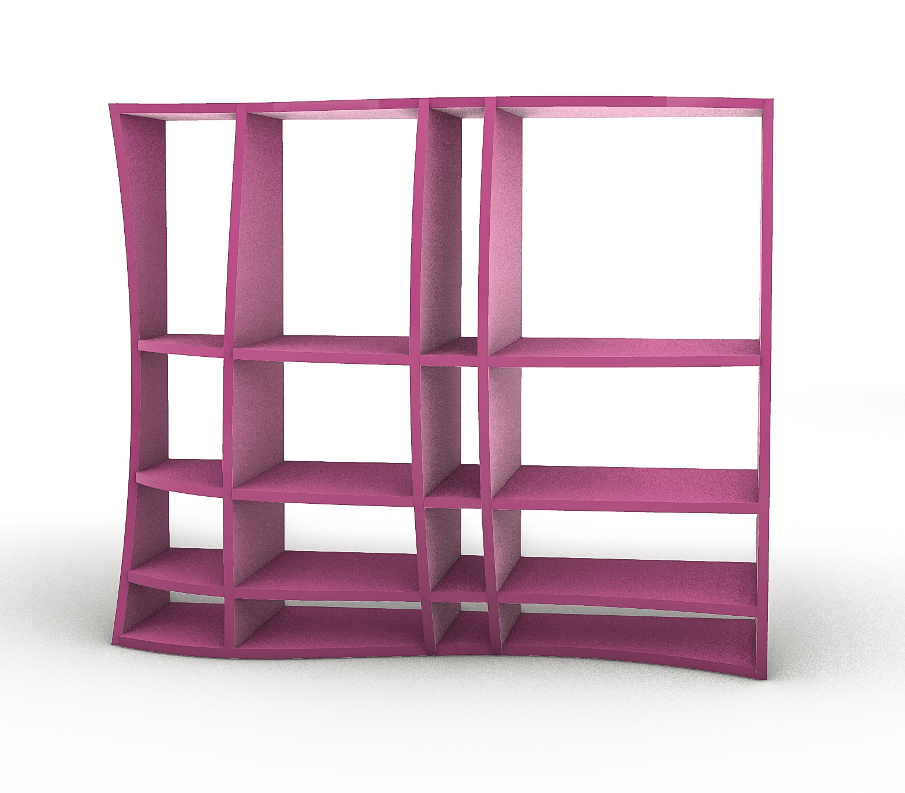
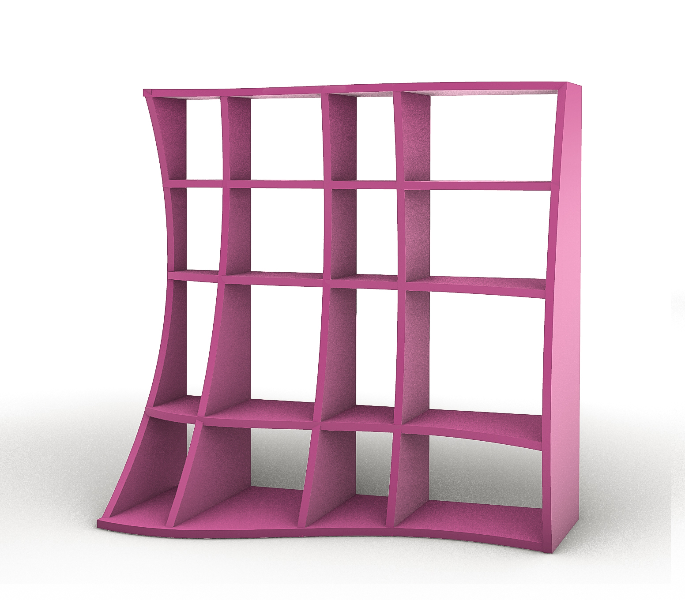
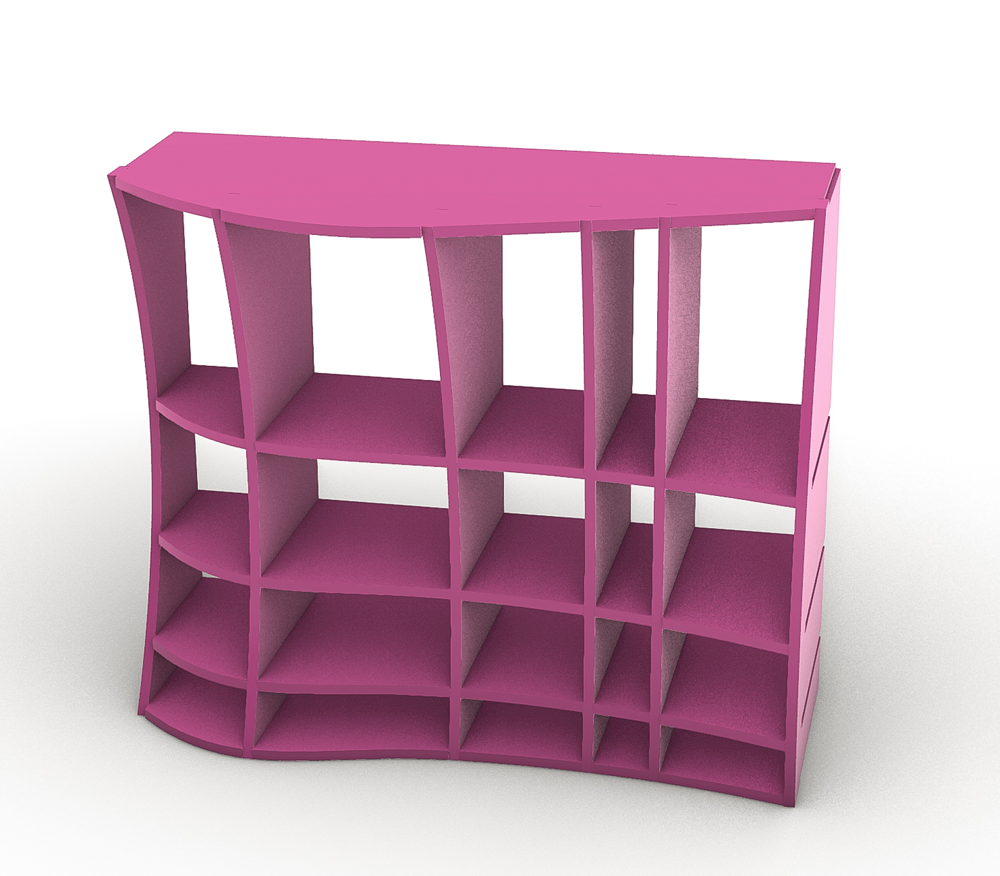

# Parametric_Shelves
Parametric shelving system

This project explores a parametric waffle-structure shelving system developed in Grasshopper.
tthe spacing between cuts is non-uniform and controlled parametrically rather than based on a fixed step.

Instead of applying equal divisions along the X and Y directions, the position of each cut is calculated individually, allowing variable density and spatial variation across the construction.
The intersections between solids are computed based on material thickness and assembly logic, ensuring that the geometry can be constructed.

  

  

  

